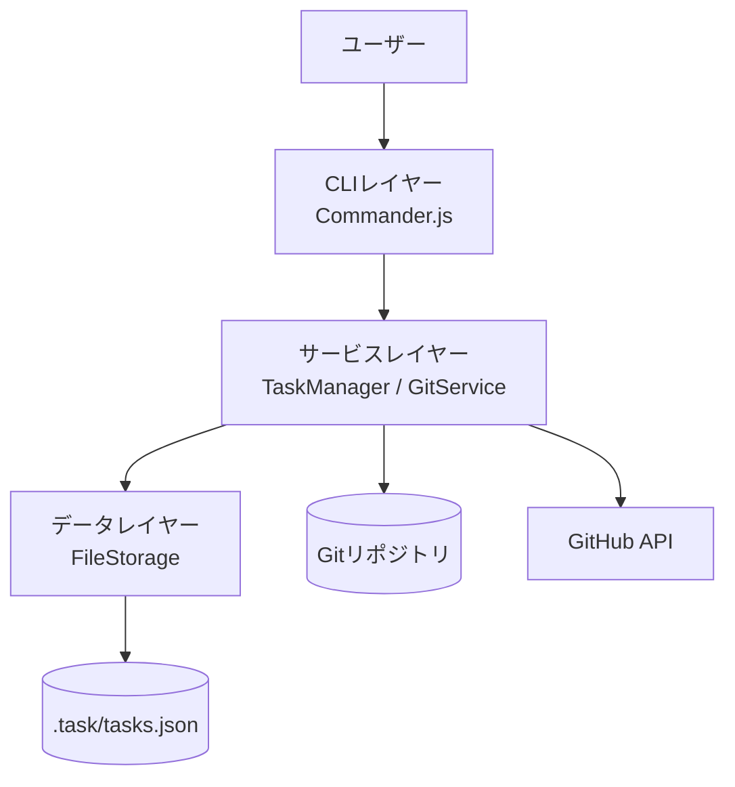
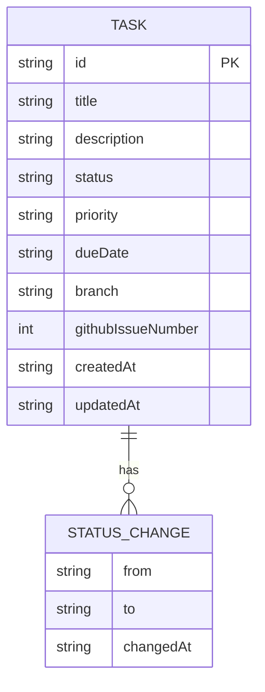
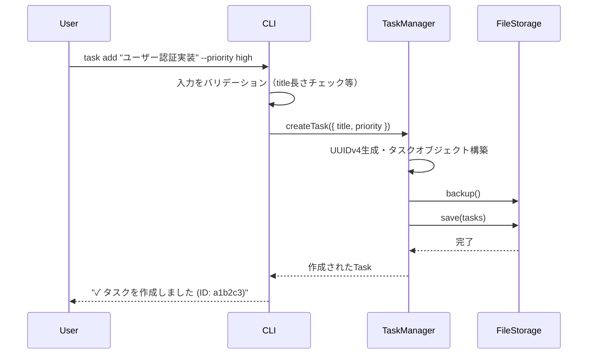
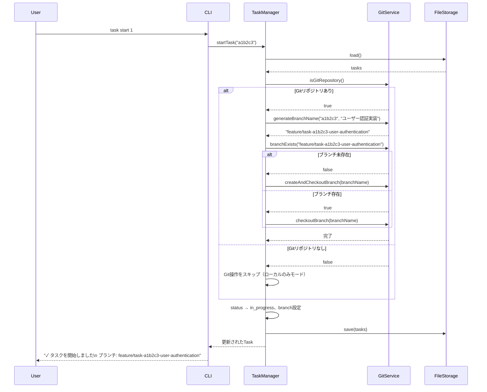
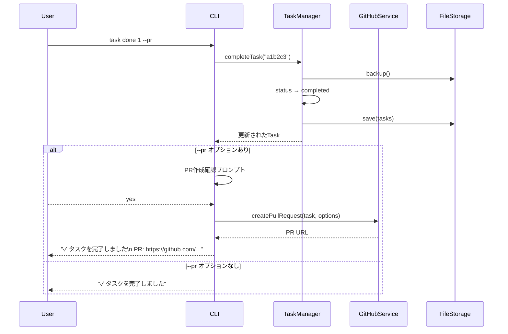
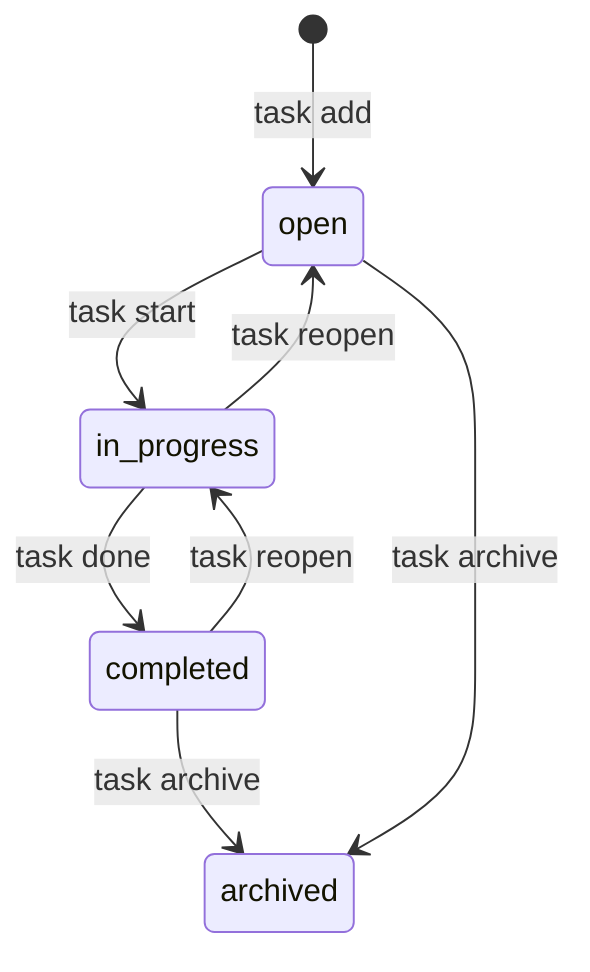

# 機能設計書 (Functional Design Document)

## システム構成図



## 技術スタック

| 分類 | 技術 | 選定理由 |
|------|------|----------|
| 言語 | TypeScript 5.x | 型安全性・開発者体験・Node.jsエコシステムとの親和性 |
| CLIフレームワーク | Commander.js | 学習コストが低く、機能が十分・広く使われている |
| Git操作 | simple-git | Node.js向けのGit操作ライブラリで実績あり |
| GitHub連携 | Octokit (GitHub REST API) | 公式クライアント・型定義完備 |
| ターミナル表示 | chalk + cli-table3 | 色付き出力とテーブル表示を両立 |
| データ保存 | JSON (MVP) → SQLite (将来) | MVPはシンプルなJSON、スケール時はSQLiteへ移行 |
| テスト | Vitest | 高速・TypeScript対応・ESM互換 |
| ビルド | tsup | TypeScriptのバンドル・CJS/ESM両対応 |

---

## データモデル定義

### エンティティ: Task

```typescript
interface Task {
  id: string;                    // UUID v4、自動採番
  title: string;                 // 1〜200文字
  description?: string;          // オプション、Markdown形式
  status: TaskStatus;            // タスクの現在の状態
  priority: TaskPriority;        // ユーザーが設定した優先度（未設定時は 'medium'）
  dueDate?: string;              // ISO 8601形式 (YYYY-MM-DD)
  branch?: string;               // 紐付けられているGitブランチ名
  githubIssueNumber?: number;    // 連携したGitHub Issue番号
  createdAt: string;             // ISO 8601形式
  updatedAt: string;             // ISO 8601形式
  statusHistory: StatusChange[]; // ステータス変更履歴
}

type TaskStatus = 'open' | 'in_progress' | 'completed' | 'archived';
type TaskPriority = 'high' | 'medium' | 'low';

interface StatusChange {
  from: TaskStatus;
  to: TaskStatus;
  changedAt: string; // ISO 8601形式
}
```

**制約**:
- `id`: UUIDv4形式、重複不可
- `title`: 必須、1〜200文字
- `status`: 4種類のみ。遷移は `open→in_progress`、`in_progress→completed`、`completed→archived` を基本とするが、強制はしない
- `branch`: `task start` 実行時に自動設定。`feature/task-<id短縮形>-<slugified-title>` 形式

---

### エンティティ: Config

```typescript
interface Config {
  githubToken?: string;       // GitHub Personal Access Token（暗号化して保存）
  githubOwner?: string;       // GitHubリポジトリオーナー
  githubRepo?: string;        // GitHubリポジトリ名
  defaultBranch: string;      // デフォルトブランチ名（デフォルト: 'main'）
  autoBackup: boolean;        // 自動バックアップ有効/無効（デフォルト: true）
}
```

---

### ER図



---

## コンポーネント設計

### CLIレイヤー (`src/cli/`)

**責務**: ユーザー入力の受付・パース、結果の整形・表示、エラーの表示

```typescript
class TaskCLI {
  register(program: Command): void;       // コマンドをCommander.jsに登録
  displayTaskList(tasks: Task[]): void;   // テーブル形式で一覧表示
  displayTask(task: Task): void;          // 詳細表示
  displaySuccess(message: string): void;
  displayError(error: AppError): void;
}
```

**依存関係**: `TaskManager`, `chalk`, `cli-table3`, `Commander.js`

---

### サービスレイヤー: TaskManager (`src/services/TaskManager.ts`)

**責務**: タスクのビジネスロジック全般

```typescript
class TaskManager {
  createTask(data: CreateTaskInput): Task;
  listTasks(filter?: TaskFilter): Task[];
  getTask(id: string): Task;
  updateTask(id: string, data: UpdateTaskInput): Task;
  deleteTask(id: string): void;
  startTask(id: string): Task;            // ステータスをin_progressに変更 + ブランチ作成
  completeTask(id: string): Task;         // ステータスをcompletedに変更
  searchTasks(keyword: string): Task[];
}

interface CreateTaskInput {
  title: string;
  description?: string;
  priority?: TaskPriority;
  dueDate?: string;
}

interface TaskFilter {
  status?: TaskStatus;
  priority?: TaskPriority;
  sortBy?: 'id' | 'priority' | 'dueDate' | 'createdAt';
  sortOrder?: 'asc' | 'desc';
}
```

**依存関係**: `FileStorage`, `GitService`

---

### サービスレイヤー: GitService (`src/services/GitService.ts`)

**責務**: Gitブランチ操作とコミット情報の取得

```typescript
class GitService {
  isGitRepository(): Promise<boolean>;
  createAndCheckoutBranch(branchName: string): Promise<void>;
  checkoutBranch(branchName: string): Promise<void>;
  branchExists(branchName: string): Promise<boolean>;
  getCurrentBranch(): Promise<string>;
  generateBranchName(taskId: string, title: string): string;
  // 例: "feature/task-a1b2c3-user-authentication"
}
```

**依存関係**: `simple-git`

---

### サービスレイヤー: GitHubService (`src/services/GitHubService.ts`)

**責務**: GitHub Issues APIとの連携

```typescript
class GitHubService {
  createPullRequest(task: Task, options: PROptions): Promise<string>; // PR URL返却
  syncIssues(tasks: Task[]): Promise<SyncResult>;
  importIssues(): Promise<Task[]>;
}
```

**依存関係**: `Octokit`, `Config`

---

### データレイヤー: FileStorage (`src/storage/FileStorage.ts`)

**責務**: JSONファイルへのタスクデータの永続化

```typescript
class FileStorage {
  load(): StorageData;
  save(data: StorageData): void;
  backup(): void;                    // .task/tasks.json.bak を作成
  exists(): boolean;
  initialize(): void;                // .task/ ディレクトリ + tasks.json の初期化
}

interface StorageData {
  version: string;
  tasks: Task[];
}
```

**依存関係**: Node.js `fs/path`

---

## ユースケース図

### タスク追加 (`task add`)



---

### タスク開始 (`task start`)



---

### タスク完了 (`task done`)



---

## タスクステータス遷移図



---

## UI設計（CLIターミナル表示）

### タスク一覧表示

```
$ task list

  ID       STATUS       TITLE                             BRANCH                              DUE
  a1b2c3   in_progress  ユーザー認証機能の実装              feature/task-a1b2c3-user-auth       2025-02-01
  b4d5e6   open         データエクスポート機能              -                                   -
  c7f8g9   completed    初期セットアップ                    feature/task-c7f8g9-initial-setup   -

  3 tasks (1 in_progress, 1 open, 1 completed)
```

### カラーコーディング

**ステータスの色分け**:
- `open`: 白（デフォルト）
- `in_progress`: 黄
- `completed`: 緑（淡色）
- `archived`: グレー

**期限の色分け**:
- 期限超過: 赤 + `(期限切れ)` サフィックス
- 期限まで3日以内: 黄 + `(あとN日)` サフィックス
- それ以外: 白

---

## ファイル構造

```
.task/
├── tasks.json      # タスクデータ本体
├── tasks.json.bak  # 直前の自動バックアップ
└── config.json     # 設定ファイル（GitHubトークン等）
```

**tasks.json の例**:
```json
{
  "version": "1.0.0",
  "tasks": [
    {
      "id": "a1b2c3d4-e5f6-7890-abcd-ef1234567890",
      "title": "ユーザー認証機能の実装",
      "description": "",
      "status": "in_progress",
      "priority": "high",
      "dueDate": "2025-02-01",
      "branch": "feature/task-a1b2c3-user-authentication",
      "githubIssueNumber": null,
      "createdAt": "2025-01-15T10:00:00.000Z",
      "updatedAt": "2025-01-15T10:30:00.000Z",
      "statusHistory": [
        { "from": "open", "to": "in_progress", "changedAt": "2025-01-15T10:30:00.000Z" }
      ]
    }
  ]
}
```

---

## パフォーマンス最適化

- **遅延読み込み**: 起動時に全タスクを一度だけ読み込み、メモリ内で操作後にまとめて保存
- **IDの短縮表示**: UUIDv4は先頭6文字のみを表示に使用し、コマンド入力も先頭6文字で一意特定できれば受理
- **GitHub API呼び出し**: `task sync` / `task import` / `--pr` 時のみ実行し、通常操作には不要

---

## セキュリティ考慮事項

- **GitHub Token**: `config.json` は `.gitignore` への追加を `task init` 時に自動提案する。ファイルパーミッションを `600` に設定する
- **コマンドインジェクション**: ブランチ名生成時はタイトルを英数字・ハイフン・アンダースコアのみのslugに正規化する。`simple-git` のAPIを通じてGitコマンドを実行し、シェルへの直接渡しを禁止する
- **入力検証**: titleの長さ・文字種、dateの形式（YYYY-MM-DD）、priorityの値域をCLIレイヤーで検証する

---

## エラーハンドリング

### エラーの分類

| エラー種別 | 処理 | ユーザーへの表示 |
|-----------|------|-----------------|
| 入力検証エラー | 処理中断 | `Error: タイトルは1〜200文字で入力してください` |
| タスク未発見 | 処理中断 | `Error: タスクが見つかりません (ID: a1b2c3)` |
| ファイル読み込みエラー | バックアップから復元を試みる | `Error: データファイルが破損しています。.task/tasks.json.bak から復元してください` |
| Gitエラー | Git操作をスキップし警告表示 | `Warning: Gitブランチの作成に失敗しました。タスクのみ更新します` |
| GitHub APIエラー | 処理中断 | `Error: GitHub APIに接続できません。トークンを確認してください` |
| Gitリポジトリ外 | Git操作をスキップ | `Info: Gitリポジトリが見つかりません。ローカルモードで動作します` |

---

## テスト戦略

### ユニットテスト
- `TaskManager`: 各メソッドの正常系・異常系（ID未発見、バリデーションエラー等）
- `GitService.generateBranchName`: 各種タイトル（日本語・記号・長いタイトル）のslug化
- `FileStorage`: 保存・読み込み・バックアップ・ファイル破損時の挙動

### 統合テスト
- `task add` → `task start` → `task done` の一連のフロー
- `FileStorage` を実際のファイルシステムで使用したCRUD操作

### E2Eテスト
- CLIコマンドを実際に実行し、標準出力と終了コードを検証
- Gitリポジトリあり/なし両方の環境でのテスト
