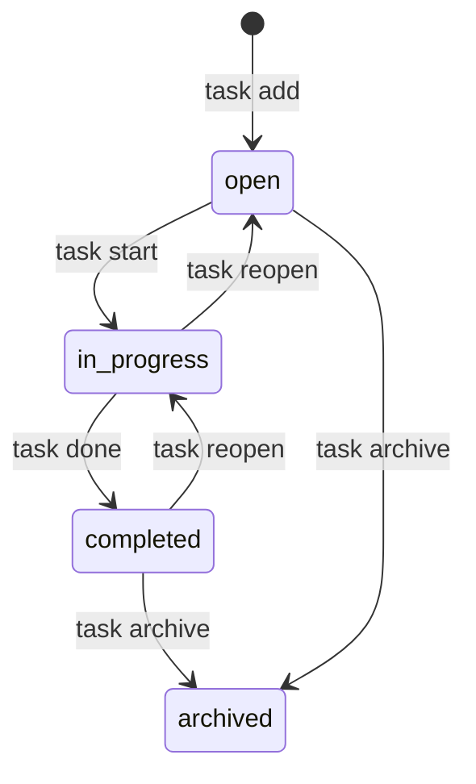

# プロジェクト用語集 (Glossary)

## 概要

このドキュメントは、TaskCLIプロジェクト内で使用される用語の定義を管理します。
チームメンバー全員が同じ言語・認識でコミュニケーションできるよう、ドメイン用語・技術用語・アーキテクチャ用語を統一的に定義します。

**更新日**: 2026-04-29

---

## ドメイン用語

### タスク (Task)

**定義**: ユーザーが完了すべき作業の最小単位。

**説明**: TaskCLIが管理するデータの中心的なエンティティ。タイトル・説明・ステータス・優先度・期限・関連Gitブランチを持つ。ターミナルから `task add` で作成され、`task done` で完了する。

**関連用語**:
- [タスクステータス](#タスクステータス-task-status)
- [タスク優先度](#タスク優先度-task-priority)
- [ショートID](#ショートid-short-id)

**使用例**:
- 「タスクを追加する」: `task add "ユーザー認証機能の実装"`
- 「タスクを開始する」: `task start a1b2c3`
- 「タスクを完了する」: `task done a1b2c3`

**データモデル**: `src/types/Task.ts`

---

### タスクステータス (Task Status)

**定義**: タスクの進行状態を示す4段階の値。

**取りうる値**:

| ステータス | 意味 | 遷移条件 |
|----------|------|---------|
| `open` | 新規・未着手 | `task add` 実行時の初期状態 |
| `in_progress` | 作業中 | `task start` 実行時 |
| `completed` | 完了 | `task done` 実行時 |
| `archived` | アーカイブ済み | `task archive` 実行時 |

**状態遷移図**:


**実装**: `src/types/Task.ts` の `TaskStatus` 型

---

### タスク優先度 (Task Priority)

**定義**: タスクの重要度・緊急度を示す3段階の指標。

**取りうる値**:
- `high`: 緊急・最優先。即座に着手すべきもの
- `medium`: 通常の優先度（デフォルト値）
- `low`: 重要度・緊急度ともに低い

**設定方法**: `task add "タイトル" --priority high` または `task update <id> --priority low`

**関連用語**: [タスク](#タスク-task)

---

### ショートID (Short ID)

**定義**: UUIDv4の先頭6文字をCLI操作用に短縮したID表現。

**説明**: タスクの内部IDはUUIDv4（例: `a1b2c3d4-e5f6-7890-abcd-ef1234567890`）だが、CLIでの入力コストを下げるために先頭6文字（例: `a1b2c3`）を使用する。先頭6文字で一意に特定できる場合はその長さで入力を受理する。衝突確率は1万件のタスクで約0.01%以下。

**使用例**:
```bash
task start a1b2c3     # ショートIDでタスクを開始
task done a1b2c3      # ショートIDでタスクを完了
task show a1b2c       # 5文字以上で一意に特定できれば受理
```

**実装**: `src/services/TaskManager.ts` の ID検索ロジック

---

### Gitブランチ連携 (Git Branch Integration)

**定義**: `task start` 実行時に、対応するGitブランチを自動で作成・切り替える機能。

**ブランチ命名規則**: `feature/task-<shortId>-<slugified-title>`

**例**:
- タスクID: `a1b2c3`、タイトル: `ユーザー認証機能の実装`
- 生成されるブランチ名: `feature/task-a1b2c3-user-authentication`
  （日本語タイトルは英語slugまたは音訳に変換）

**Gitリポジトリ外での動作**: ブランチ作成をスキップし、タスクのステータスのみ更新する（ローカルモード）。

**関連用語**: [ショートID](#ショートid-short-id)

**実装**: `src/services/GitService.ts`

---

### ローカルモード (Local Mode)

**定義**: Gitリポジトリが存在しない環境でTaskCLIを使用する際の動作モード。

**説明**: Gitリポジトリ外でコマンドを実行した場合、ブランチ作成・切り替えをスキップし、タスクデータのみをローカルJSON（`.task/tasks.json`）で管理する。GitHub連携機能も使用不可。

**通知方法**: `Info: Gitリポジトリが見つかりません。ローカルモードで動作します`

---

### タスクデータファイル (Task Data File)

**定義**: タスクデータを保存するローカルJSONファイル。

**パス**: `.task/tasks.json`（プロジェクトルート相対）

**形式**: `StorageData` 型に従ったJSON。バージョン番号とタスク配列を持つ。

**バックアップ**: 書き込み操作の直前に `.task/tasks.json.bak` へ自動コピー。

**Gitでの管理**: チームでのタスク共有のためGitコミット可能（デフォルトで `.gitignore` 対象外）。

---

## 技術用語

### Commander.js

**定義**: Node.js向けのCLIコマンドパース・ルーティングライブラリ。

**本プロジェクトでの用途**: `task add`, `task list`, `task start` 等のすべてのCLIコマンドの定義とオプション解析に使用。

**バージョン**: ^12.0.0

**選定理由**: 最も広く使われているNode.js向けCLIフレームワーク。ヘルプの自動生成、サブコマンドのネスト等の機能が充実し、学習コストが低い。

**設定ファイル**: `src/cli/TaskCLI.ts`

**関連ドキュメント**: [アーキテクチャ設計書](./architecture.md)

---

### simple-git

**定義**: Node.js向けのGit操作ラッパーライブラリ。

**本プロジェクトでの用途**: `task start` 時のブランチ作成・切り替え、現在ブランチの取得等のGit操作。シェル文字列を直接構築せず、このライブラリのAPIを通じてのみGitを操作する（コマンドインジェクション対策）。

**バージョン**: ^3.0.0

**設定ファイル**: `src/services/GitService.ts`

---

### Octokit (@octokit/rest)

**定義**: GitHub公式のNode.js向けREST APIクライアント。

**本プロジェクトでの用途**: `task sync`・`task import --github`・`task done --pr` 等のGitHub連携機能（P1機能）。

**バージョン**: ^20.0.0

**認証**: Personal Access Token（`.task/config.json` に保存）

**設定ファイル**: `src/services/GitHubService.ts`

---

### Vitest

**定義**: Viteベースの高速なJavaScript/TypeScriptテストフレームワーク。

**本プロジェクトでの用途**: ユニットテスト・統合テスト・E2Eテスト全てに使用。`vi.fn()` でモックを作成する。

**バージョン**: ^2.0.0

**選定理由**: TypeScript・ESMをネイティブサポートし、追加設定なしで動作する。Jestと互換APIを持ちながら高速起動。

**設定ファイル**: `vitest.config.ts`

---

### tsup

**定義**: esbuildベースのTypeScriptバンドル・ビルドツール。

**本プロジェクトでの用途**: TypeScriptソースをCJS/ESM両形式でビルドし、npmで配布可能なCLIバイナリを生成する。

**バージョン**: ^8.0.0

**選定理由**: 設定ファイルがほぼ不要で、CJS/ESM両対応の高速ビルドが可能。

---

## 略語・頭字語

### CLI

**正式名称**: Command Line Interface

**意味**: コマンドラインから操作するインターフェース。マウス操作を必要とせず、キーボードでテキストコマンドを入力して操作する。

**本プロジェクトでの使用**: TaskCLIのメインインターフェース。全機能をターミナルから操作できる。

**実装**: `src/cli/` ディレクトリ

---

### CRUD

**正式名称**: Create, Read, Update, Delete

**意味**: データ操作の4基本操作（作成・読み取り・更新・削除）。

**本プロジェクトでの使用**: タスクの基本操作（`task add` / `task list` / `task update` / `task delete`）を指す際に使用。

---

### MVP

**正式名称**: Minimum Viable Product

**意味**: 最小限の機能を備えたプロダクト。

**本プロジェクトでの使用**: P0優先度として分類された機能群（タスクCRUD・ステータス管理・Gitブランチ連携・JSONデータ永続化）がMVPに相当する。

**関連ドキュメント**: [プロダクト要求定義書](./product-requirements.md)

---

### PR

**正式名称**: Pull Request

**意味**: GitHubにおいて、ブランチの変更をレビューし、他のブランチへマージするための申請機能。

**本プロジェクトでの使用**:
1. TaskCLI自体の開発フローにおけるコードレビュープロセス
2. `task done --pr` で自動作成されるユーザープロジェクトのPull Request

---

### UUID / UUIDv4

**正式名称**: Universally Unique Identifier (version 4)

**意味**: ランダムな128ビット値で生成される一意識別子。`xxxxxxxx-xxxx-4xxx-yxxx-xxxxxxxxxxxx` 形式。

**本プロジェクトでの使用**: タスクIDとして使用。ライブラリ `uuid` の `v4()` 関数で生成する。表示・入力時は先頭6文字の[ショートID](#ショートid-short-id)を使用。

---

## アーキテクチャ用語

### レイヤードアーキテクチャ (Layered Architecture)

**定義**: システムを役割ごとに複数の層（レイヤー）に分割し、上位層から下位層への一方向の依存関係のみを許可する設計パターン。

**本プロジェクトでの適用**:
```
CLIレイヤー (src/cli/)
    ↓ 依存OK
サービスレイヤー (src/services/)
    ↓ 依存OK
ストレージ抽象化レイヤー (src/storage/)
    ↓
データ (.task/tasks.json)
```

**禁止される依存**:
- `src/storage/` → `src/services/` (❌)
- `src/services/` → `src/cli/` (❌)

**メリット**: 各レイヤーを独立してテスト可能。変更の影響範囲が局所化される。

**関連コンポーネント**: `TaskManager`, `GitService`, `FileStorage`

**関連ドキュメント**: [アーキテクチャ設計書](./architecture.md)

---

### ストレージ抽象化 (Storage Abstraction)

**定義**: データ永続化の実装詳細（JSONファイル・SQLite等）を `IStorage` インターフェースで隠蔽する設計パターン。

**本プロジェクトでの適用**: `IStorage` インターフェース（`src/storage/IStorage.ts`）を `FileStorage` が実装する。将来SQLiteへ移行する場合、`SqliteStorage` クラスを追加するだけでサービスレイヤーを変更せずに移行できる。

**関連コンポーネント**: `IStorage`, `FileStorage`

---

### ステアリングファイル (Steering File)

**定義**: 特定の開発作業における「今回何をするか」を定義する、作業単位のドキュメント群。

**保存場所**: `.steering/[YYYYMMDD]-[タスク名]/`

**構成ファイル**:
- `requirements.md`: 今回の作業の要求内容
- `design.md`: 実装アプローチ
- `tasklist.md`: 具体的なタスクリスト

**命名例**: `.steering/20250115-add-git-integration/`

**関連ドキュメント**: [リポジトリ構造定義書](./repository-structure.md)

---

## エラー・例外

### AppError

**クラス名**: `AppError`

**継承元**: `Error`

**発生条件**: プロジェクト内で定義するすべてのカスタムエラーの基底クラス。直接はスローしない。

**実装箇所**: `src/types/errors.ts`

---

### ValidationError

**クラス名**: `ValidationError`

**継承元**: `AppError`

**発生条件**: ユーザー入力がバリデーションルールに違反した場合。タイトルが空・200文字超、日付形式が不正、priority値が規定外、等。

**対処方法**:
- ユーザー: エラーメッセージに従い入力値を修正する
- 開発者: `src/validators/TaskValidator.ts` のバリデーションロジックを確認する

**使用例**:
```typescript
throw new ValidationError('タイトルは1〜200文字で入力してください', 'title');
```

---

### NotFoundError

**クラス名**: `NotFoundError`

**継承元**: `AppError`

**発生条件**: 指定されたIDに一致するタスクが見つからない場合。

**エラーメッセージ形式**: `タスク が見つかりません (ID: <id>)`

**対処方法**:
- ユーザー: `task list` で正しいIDを確認してから再実行する
- 開発者: ID検索ロジック（先頭N文字マッチ）を確認する

**使用例**:
```typescript
throw new NotFoundError('タスク', id);
```

---

## 索引

### あ行
- [アーカイブ（ステータス）](#タスクステータス-task-status) — ドメイン用語

### か行
- [ギットブランチ連携](#gitブランチ連携-git-branch-integration) — ドメイン用語

### さ行
- [ショートID](#ショートid-short-id) — ドメイン用語
- [ステアリングファイル](#ステアリングファイル-steering-file) — アーキテクチャ用語
- [ストレージ抽象化](#ストレージ抽象化-storage-abstraction) — アーキテクチャ用語

### た行
- [タスク](#タスク-task) — ドメイン用語
- [タスクステータス](#タスクステータス-task-status) — ドメイン用語
- [タスクデータファイル](#タスクデータファイル-task-data-file) — ドメイン用語
- [タスク優先度](#タスク優先度-task-priority) — ドメイン用語

### ら行
- [レイヤードアーキテクチャ](#レイヤードアーキテクチャ-layered-architecture) — アーキテクチャ用語
- [ローカルモード](#ローカルモード-local-mode) — ドメイン用語

### A-Z
- [AppError](#apperror) — エラー
- [CLI](#cli) — 略語
- [Commander.js](#commanderjs) — 技術用語
- [CRUD](#crud) — 略語
- [MVP](#mvp) — 略語
- [NotFoundError](#notfounderror) — エラー
- [Octokit](#octokit-octokitrest) — 技術用語
- [PR](#pr) — 略語
- [simple-git](#simple-git) — 技術用語
- [tsup](#tsup) — 技術用語
- [UUID / UUIDv4](#uuid--uuidv4) — 略語
- [ValidationError](#validationerror) — エラー
- [Vitest](#vitest) — 技術用語
